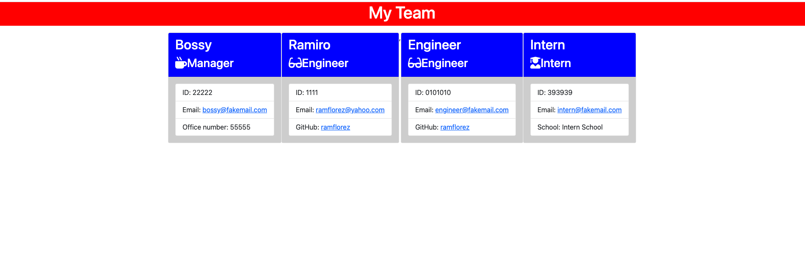

# Team_Profile_Generator

 

Node.js, Inquirer package, Jest, HTML, CSS

ramflorez@yahoo.com

# Walkthrough Video

Please follow this link for a walkthough video of the working application.

- [Video LInk](https://drive.google.com/file/d/12R2UikF0NAISLZ_GkbeXIgTeOBDWTuN_/view?usp=sharing)

# Generated html Screenshot

 
   
## Description 
  
  This application is created with node.js, inquirer package and jest that allows creating a high-quality html file by answering questions generated by a prompt to build a team of a manager, engineers and interns. 
  
## Table of contents
  
  - [Description](#Description)
  - [Installation](#Installation)
  - [usage](#usage)
  - [License](#License)
  - [Contributing](#Contributing)
  - [Test](#Test)
  - [Repository Link](#Repository)
  - [GitHub & Questions](#GitHub_&_Questions) 
    
## Installation
  
          First run npm install to install json & inquirer package. Then, invoke the application by running node index.js and answer the questions. A high quality html file will be generated. Look for the Readme file in the "dist" folder with the label "rendered.html".

## Usage
  
  It allows to create a high-quality html file to show the organization of a team of one manager, engineers and interns in an easy and expedite way. The user only needs to answer the questions that are formulated.
  
## License
  
  MIT
  
## Contributing
  
  Myself, Ramiro Florez, ramflorez@yahoo.com
  
## Test
  
  npm run test
   
## Repository
  
  - [Project Repo](https://github.com/ramflorez/Team_Profile_Generator)
  
## Sample HTML File

  A sample of a generated file can be found in the repository files, inside the "dist" folder with the name "rendered.html". Please follow this link.

  <a href="dist/rendered.html"> Sample HTML</a>
  
## GitHub_&_Questions

  
  - Ramiro Florez
  - [GitHub Profile](https://github.com/ramflorez)
  - ramflorez@yahoo.com
  